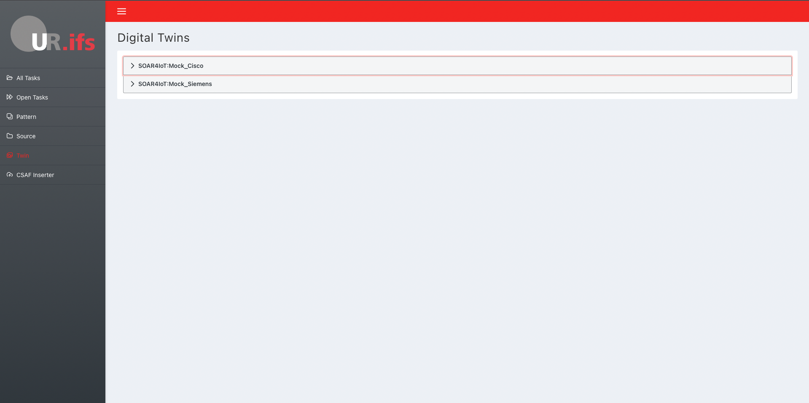
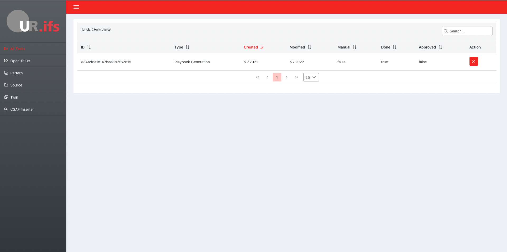
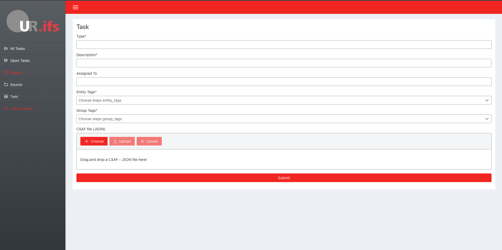

# Ad2Play Prototype

In this reporsitory you can find the prototype of a SOAR solution that is aimed towards the automation of the incident response process for industrial IoT devices. The overall structure of the concept is shown in the following figure.

## Demo

https://user-images.githubusercontent.com/23430598/213645215-1a8bd4e2-4aec-4dba-9de1-5991a318b93f.mp4

## Concept Structure

The system is implemented as a front- and backand solution based on Vue.js and Node.js. The code located in this repository represents the central block called the "SOAR-Platform". The other two key building blocks of the concept are a MongoDB database on which all relevant data is perssted as well as the digital twins. To keep the complexity of the system low, the twins are mocked in the backend component.

### Frontend Structure

The frontend consits of six components that are combined to provide the full functionality available for the user. The different components are described in further detail in the UI presentation. The Vuex-Store is used for the state management that controlls the complete backend communication and provides all data to the different components. To create navigation through the website the router is managing the transitions between the different components in order to display the right information in the UI-Framework.

### Backend Structure

The backend component is implemented using the MVCS-pattern for structuring the code. All database related code, affecting the different documents required for the process, are split into the models, controllers and services. The security advisories are imported by the source adapters, which provide separate access services for every single source the system is using. As already mentioned, the digital twins are mocked in this component in order to avoid overhead. The server is responsible for managing all communication requests by the frontend.

## UI

### Source Overview

This screen presents the different sources connected for the security advisory search. It also shows the timestamps of the last fetching-action for each source.

### Twin Overview

In this screen the complete JSON representation of the digital twins can be seen, so that the user can understand the connections between the sources and genereated tasks.

### Task Overview

This list shows all tasks that were generated by the system. For more details the list items can be clicked in order to get to the specific task page.

### Task Detail Page

This page shows the genereal information of the task, the CSAF document it is based on and a CACAO playbook if one could be derived automatically by the system. Other that the presentation of the information, the CACAO playbooks can be created or altered by the configurator.

### Playbook Configurator

The configurator gives the user the chance to alter or create CACAO compliant playbooks for the individual task. 

### CASF Inserter

This functionality was added to allow users to create tasks manually by parsing in CSAF JSON-documents. The created tasks are then investigated by the playbook derivation algorithm to check if a playbook can be generated automatically.

